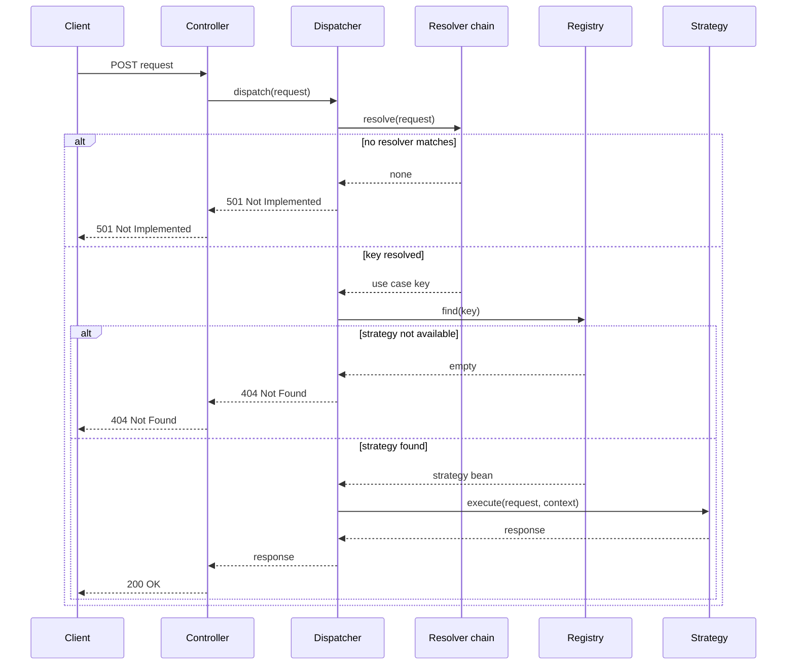

# Implementation plan: Switchboard — Spring Boot 4.x library

Paste this as the argument to `/speckit.plan`, after `/speckit.specify` has run.

## Stack

- Java 17+, Spring Boot 4.x, Spring Framework 7, Jakarta EE 11 / Servlet 6.1
- Two modules, one release: `switchboard-autoconfigure` (all code) + `switchboard-spring-boot-starter` (dependency-only)
- Artifacts: `com.yourorg:switchboard-autoconfigure`, `com.yourorg:switchboard-spring-boot-starter`

## Design patterns

| Pattern | Where | Why |
|---|---|---|
| Strategy | `SwitchboardStrategy<Req, Res>` per use case | Same interface, swappable business logic |
| Chain of Responsibility | Resolver chain | Header → payload → route checked in order, each resolver answers or defers |
| Registry | `SwitchboardRegistry` | Spring auto-collects all strategy beans at startup; no manual factory needed |
| Decorator (Spring AOP) | Logging/metrics around dispatch | Keeps strategies free of cross-cutting boilerplate |

Considered and set aside: a rules engine (Drools or similar) for resolution — only worth it if resolution logic needs boolean combinations across fields; a priority-ordered chain is simpler for the current requirement.

## Module layout

```
switchboard-autoconfigure
├── SwitchboardStrategy<Req, Res>                  (interface)
├── SwitchboardContext                             (resolved metadata: matched key, correlation id)
├── @SwitchboardCase                                (annotation for self-registration)
├── SwitchboardRegistry
├── SwitchboardResolver / HeaderResolver / PayloadFieldResolver / RouteResolver
├── SwitchboardResolverChain
├── SwitchboardDispatcher
├── SwitchboardAutoConfiguration
├── SwitchboardProperties                          (@ConfigurationProperties(prefix = "switchboard"))
├── SwitchboardUnresolvedException / SwitchboardNotAvailableException
├── SwitchboardExceptionHandler                     (@RestControllerAdvice)
├── SwitchboardEndpoint                             (actuator endpoint)
└── META-INF/spring/org.springframework.boot.autoconfigure.AutoConfiguration.imports

switchboard-spring-boot-starter
├── depends on: switchboard-autoconfigure
└── depends on: spring-boot-starter-webmvc
```

## Core interface

```java
public interface SwitchboardStrategy<Req, Res> {
    Res execute(Req request, SwitchboardContext context);
    String caseKey(); // e.g. "REFUND_STANDARD", "REFUND_EXPEDITED"
}
```

Self-registration via annotation:

```java
@Target(ElementType.TYPE)
@Retention(RetentionPolicy.RUNTIME)
@Component
public @interface SwitchboardCase {
    String value();
}
```

```java
// example of a strategy a CONSUMING app would write — not part of this library
@SwitchboardCase("REFUND_STANDARD")
@ConditionalOnProperty(prefix = "switchboard.refund-standard", name = "enabled", havingValue = "true", matchIfMissing = true)
public class StandardRefundStrategy implements SwitchboardStrategy<RefundRequest, RefundResponse> {
    public RefundResponse execute(RefundRequest request, SwitchboardContext context) { /* business logic */ }
    public String caseKey() { return "REFUND_STANDARD"; }
}
```

## Registry

```java
@Component
public class SwitchboardRegistry {
    private final Map<String, SwitchboardStrategy<?, ?>> strategies;

    public SwitchboardRegistry(List<SwitchboardStrategy<?, ?>> beans) {
        Objects.requireNonNull(beans, "beans must not be null");
        this.strategies = Map.copyOf(beans.stream()
            .collect(Collectors.toMap(
                SwitchboardStrategy::caseKey,
                Function.identity(),
                (first, second) -> {
                    throw new IllegalStateException(
                        "Duplicate Switchboard case key '" + first.caseKey() + "' registered by both "
                        + first.getClass().getName() + " and " + second.getClass().getName());
                })));
    }

    public Optional<SwitchboardStrategy<?, ?>> find(String key) {
        return Optional.ofNullable(strategies.get(key));
    }
}
```

The explicit merge function (Item 49: fail fast with a message that names the actual conflict) replaces `Collectors.toMap`'s default behavior, which would otherwise silently keep whichever strategy happened to be processed last. Wrapping the result in `Map.copyOf` (Item 17: minimize mutability) means the registry can never be mutated after construction, even accidentally from within this class.

## Resolver chain

```java
public interface SwitchboardResolver {
    Optional<String> resolve(jakarta.servlet.http.HttpServletRequest httpRequest, Object payload);
}

@Component
@Order(1)
public class HeaderResolver implements SwitchboardResolver {
    public Optional<String> resolve(HttpServletRequest req, Object payload) {
        return Optional.ofNullable(req.getHeader("X-Switchboard-Case"));
    }
}

@Component
@Order(2)
public class PayloadFieldResolver implements SwitchboardResolver {
    public Optional<String> resolve(HttpServletRequest req, Object payload) {
        if (payload instanceof SwitchboardDiscriminated d) return Optional.ofNullable(d.getSwitchboardCase());
        return Optional.empty();
    }
}

@Component
@Order(3)
public class RouteResolver implements SwitchboardResolver {
    public Optional<String> resolve(HttpServletRequest req, Object payload) {
        return RouteMap.lookup(req.getRequestURI());
    }
}

@Component
public class SwitchboardResolverChain {
    private final List<SwitchboardResolver> resolvers; // ordered per config, see below

    public SwitchboardResolverChain(List<SwitchboardResolver> resolvers) {
        Objects.requireNonNull(resolvers, "resolvers must not be null");
        this.resolvers = List.copyOf(resolvers); // defensive copy (Item 50) + immutable (Item 17)
    }

    public String resolve(HttpServletRequest req, Object payload) {
        return resolvers.stream()
            .map(r -> r.resolve(req, payload))
            .filter(Optional::isPresent)
            .map(Optional::get)
            .findFirst()
            .orElseThrow(() -> new SwitchboardUnresolvedException(req.getRequestURI()));
    }
}
```

## Dispatcher and controller integration

```java
@Service
public class SwitchboardDispatcher {
    private final SwitchboardResolverChain resolver;
    private final SwitchboardRegistry registry;

    public SwitchboardDispatcher(SwitchboardResolverChain resolver, SwitchboardRegistry registry) {
        this.resolver = Objects.requireNonNull(resolver, "resolver must not be null");
        this.registry = Objects.requireNonNull(registry, "registry must not be null");
    }

    public <Req, Res> Res dispatch(HttpServletRequest httpRequest, Req request) {
        String key = resolver.resolve(httpRequest, request);
        // Unchecked cast is unavoidable: the registry is keyed by runtime strings (caseKey()),
        // so the compiler cannot verify Req/Res line up with the resolved strategy. Safe because
        // caseKey() uniquely identifies one strategy type per key by construction (Item 27: scope
        // the suppression to this one declaration, not the whole method).
        @SuppressWarnings("unchecked")
        SwitchboardStrategy<Req, Res> strategy = (SwitchboardStrategy<Req, Res>) registry.find(key)
            .orElseThrow(() -> new SwitchboardNotAvailableException(key));
        return strategy.execute(request, new SwitchboardContext(key));
    }
}
```

```java
// example controller in a CONSUMING app — not part of this library
@PostMapping("/api/refunds")
public RefundResponse handleRefund(HttpServletRequest http, @RequestBody RefundRequest request) {
    return dispatcher.dispatch(http, request);
}
```

## Auto-configuration

```java
@AutoConfiguration
@EnableConfigurationProperties(SwitchboardProperties.class)
@ConditionalOnProperty(prefix = "switchboard", name = "enabled", matchIfMissing = true)
public class SwitchboardAutoConfiguration {

    @Bean
    @ConditionalOnMissingBean
    public SwitchboardRegistry switchboardRegistry(List<SwitchboardStrategy<?, ?>> strategies) {
        return new SwitchboardRegistry(strategies);
    }

    @Bean
    @ConditionalOnMissingBean
    public SwitchboardResolverChain compositeSwitchboardResolver(List<SwitchboardResolver> resolvers, SwitchboardProperties props) {
        return new SwitchboardResolverChain(reorder(resolvers, props.getResolutionOrder()));
    }

    @Bean
    @ConditionalOnMissingBean
    public SwitchboardDispatcher switchboardDispatcher(SwitchboardResolverChain resolver, SwitchboardRegistry registry) {
        return new SwitchboardDispatcher(resolver, registry);
    }
}
```

Registration file:

```
# src/main/resources/META-INF/spring/org.springframework.boot.autoconfigure.AutoConfiguration.imports
com.yourorg.switchboard.SwitchboardAutoConfiguration
```

## Configuration schema

```yaml
switchboard:
  enabled: true
  resolution:
    order: [header, payload, route]
    header-name: X-Switchboard-Case
  refund-standard:
    enabled: true
  refund-expedited:
    enabled: true
  refund-legacy:
    enabled: false
```

## Error handling

```java
public class SwitchboardUnresolvedException extends RuntimeException {
    public SwitchboardUnresolvedException(String uri) { super("No resolver matched a use case for: " + uri); }
    public SwitchboardUnresolvedException(String uri, Throwable cause) {
        super("No resolver matched a use case for: " + uri, cause); // Item 73: preserve the original cause
    }
}

public class SwitchboardNotAvailableException extends RuntimeException {
    public SwitchboardNotAvailableException(String key) { super("Use case '" + key + "' is not registered or is disabled"); }
    public SwitchboardNotAvailableException(String key, Throwable cause) {
        super("Use case '" + key + "' is not registered or is disabled", cause);
    }
}

@RestControllerAdvice
public class SwitchboardExceptionHandler {
    @ExceptionHandler(SwitchboardUnresolvedException.class)
    public ResponseEntity<ErrorResponse> handleUnresolved(SwitchboardUnresolvedException ex) {
        return ResponseEntity.status(HttpStatus.NOT_IMPLEMENTED).body(new ErrorResponse("USE_CASE_UNRESOLVED", ex.getMessage()));
    }

    @ExceptionHandler(SwitchboardNotAvailableException.class)
    public ResponseEntity<ErrorResponse> handleNotAvailable(SwitchboardNotAvailableException ex) {
        return ResponseEntity.status(HttpStatus.NOT_FOUND).body(new ErrorResponse("USE_CASE_NOT_AVAILABLE", ex.getMessage()));
    }
}
```

## Observability: actuator endpoint

```java
@Component
@Endpoint(id = "switchboard")
public class SwitchboardEndpoint {
    private final SwitchboardRegistry registry;
    private final SwitchboardProperties properties;

    public SwitchboardEndpoint(SwitchboardRegistry registry, SwitchboardProperties properties) {
        this.registry = Objects.requireNonNull(registry, "registry must not be null");
        this.properties = Objects.requireNonNull(properties, "properties must not be null");
    }

    @ReadOperation
    public SwitchboardReport report() {
        List<SwitchboardEntry> entries = properties.getAllConfiguredKeys().stream()
            .map(key -> {
                var strategy = registry.find(key).orElse(null);
                return new SwitchboardEntry(key, properties.isEnabled(key), strategy != null,
                    strategy != null ? strategy.getClass().getName() : null,
                    properties.getOwner(key), properties.getVersion(key), properties.getDescription(key));
            })
            .toList();
        return new SwitchboardReport(new ResolutionInfo(properties.getResolutionOrder(), properties.getHeaderName()), entries);
    }
}
```

```java
@Bean
@ConditionalOnClass(Endpoint.class)
@ConditionalOnAvailableEndpoint
public SwitchboardEndpoint switchboardEndpoint(SwitchboardRegistry registry, SwitchboardProperties properties) {
    return new SwitchboardEndpoint(registry, properties);
}
```

```yaml
management:
  endpoint:
    switchboard:
      enabled: true
  endpoints:
    web:
      exposure:
        include: health, info, switchboard
```

Restrict this endpoint the same way you'd restrict `/actuator/env` or `/actuator/beans` — it reveals internal architecture.

## Request flow



## Testing plan

- Unit test each resolver in isolation given a mock request/payload.
- Unit test `SwitchboardResolverChain` precedence given different config orders.
- Unit test `SwitchboardRegistry` and `SwitchboardDispatcher` with mock strategies.
- `ApplicationContextRunner`-based test verifying auto-configuration activates, backs off when `switchboard.enabled=false`, and respects `@ConditionalOnMissingBean`.
- A minimal sample Spring Boot 4.x application with one real strategy, exercised end-to-end (integration test hitting a real controller).

## Publishing

- Artifacts: `com.yourorg:switchboard-autoconfigure`, `com.yourorg:switchboard-spring-boot-starter`, Nexus `maven-releases` repository, released together at the same version.
- Fresh version line starting at 2.0.0 — not a continuation of the retired Boot 2/3 line.
